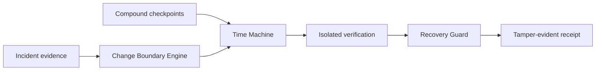

# Reprise

<p align="center"></p>

<p align="center"><strong>Recover the whole backend, not just the database.</strong></p>

<p align="center">
  
  
  
  
</p>

Reprise is a local-first recovery and compatibility control plane for changing backends. It models deployments, schema, functions, storage contracts, auth, configuration, and dependencies as evidence-backed historical state. It chooses a mutually compatible recovery candidate, verifies it in isolation, and refuses unsafe promotion by default.

## Status

`v1.1.0-rc.1` is a release candidate, not a production release. The core recovery path is verified locally: compound checkpoints, deterministic reconstruction, change-boundary analysis, Reprise Signal, stale-plan blocking, verification receipts, durable local checkpoints, and a credential-free acquisition demo. The Neon branch-lifecycle adapter is covered by mocked provider contract tests; it has not been exercised against a live account. See [limitations](docs/V1_LIMITATIONS.md).

## Quick start

Requires Node.js 20+ and pnpm 11.19.0 (Corepack recommended).

```powershell
pnpm install --frozen-lockfile
pnpm build
pnpm test
node apps/cli/dist/index.js demo acquisition
```

The demo is a deterministic local fixture. It does not contact Neon and does not mutate production.

## Reprise Signal

Reprise Signal is an auditable recoverability passport for a checkpoint. It carries a deterministic signature and exposes compatibility, evidence count, verification, freshness, and unknowns as separate dimensions. It never collapses uncertainty into a misleading “healthy” score.

## Safety model

Reprise treats `UNKNOWN` compatibility as blocking by default. A Recovery Guard checks the backend revision used to construct a candidate before promotion, and requires a verified receipt. No production restore command is exposed by the CLI.

## Architecture



See [V1 architecture](docs/V1_ARCHITECTURE.md), [capability matrix](docs/V1_CAPABILITY_MATRIX.md), [Neon provider notes](docs/providers/neon.md), and [CLI reference](docs/CLI.md).

## Public demo and diligence

The static site lives in [website](website) and contains an interactive deterministic recovery walk-through. The GitHub Pages workflow deploys it only after repository Pages is configured. The local acquisition demo is the executable source of truth; it does not contact a provider.

The [acquisition package](acquisition) documents technology, IP, dependencies, security posture, transferability, limitations, and the integration map. It is intentionally factual: it does not claim provider capabilities that have not been implemented and tested.

## Licensing

Reprise is proprietary and unpublished. See [LICENSE](LICENSE) and [commercial/evaluation access](COMMERCIAL_LICENSE.md). Access to source or a demo does not grant use or distribution rights; external evaluation requires a written agreement.
