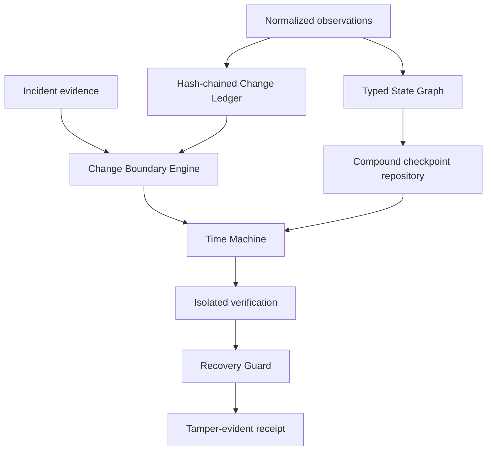
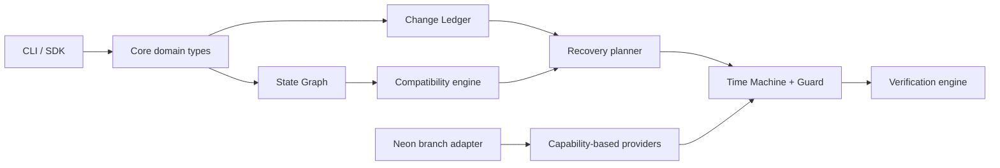

# Reprise

<p align="center">
  
</p>

<p align="center"><strong>Recover the whole backend, not just the database.</strong></p>

<p align="center">
  <a href="https://github.com/theworker02/reprise/releases"></a>
  <a href="https://github.com/theworker02/reprise/actions/workflows/ci.yml"></a>
  
  
  
  
</p>

Reprise is a local-first recovery and compatibility control plane for changing backends. It records how deployments, database schema, migrations, functions, configuration, storage contracts, authentication, and dependency sets relate over time. Given an incident, Reprise identifies a defensible compatible historical checkpoint, reconstructs it in isolation, records verification evidence, and prevents promotion when evidence is incomplete.

It is designed for the question infrastructure teams ask during a difficult rollback:

> What was the last mutually compatible state of this backend, and can we prove that it is safer than the state we have now?

Reprise is intentionally not a database-backup wrapper. A snapshot may restore data while leaving the deployed application, migration lineage, contracts, or configuration incompatible. Reprise treats recovery as a cross-component compatibility problem.

## Release status

**Current release:** [`v1.1.0-rc.2`](https://github.com/theworker02/reprise/releases/tag/v1.1.0-rc.2) — a technically validated release candidate, not a general-availability production release.

The core recovery reasoning path is verified locally and in CI: immutable graph and ledger behavior, evidence-based compatibility decisions, compound checkpoints, deterministic historical reconstruction, change-boundary analysis, recovery guardrails, tamper-evident receipts, durable local checkpoints, and the credential-free acquisition demonstration. The Neon branch-lifecycle adapter is covered by mocked provider contract tests; it has **not** been exercised against a live Neon account.

Read the [release notes](CHANGELOG.md), [capability matrix](docs/V1_CAPABILITY_MATRIX.md), and [known limitations](docs/V1_LIMITATIONS.md) before evaluating the project for production use.

## Contents

- [Why Reprise](#why-reprise)
- [What is implemented](#what-is-implemented)
- [Safety model](#safety-model)
- [Architecture](#architecture)
- [Quick start](#quick-start)
- [Run the recovery demonstration](#run-the-recovery-demonstration)
- [Neon integration](#neon-integration)
- [Configuration and provider model](#configuration-and-provider-model)
- [Verification and auditability](#verification-and-auditability)
- [Repository layout](#repository-layout)
- [Development and validation](#development-and-validation)
- [Documentation and diligence](#documentation-and-diligence)
- [Security, telemetry, and licensing](#security-telemetry-and-licensing)

## Why Reprise

Traditional rollback tooling normally answers one narrow question: how to restore a particular system. Production incidents rarely stay that narrow. A migration, an application deployment, a function revision, an environment change, and a storage contract can all be individually valid yet mutually incompatible.

Reprise maintains an evidence-backed view of those relationships. It uses typed historical records and explicit compatibility results rather than timestamp matching or a single “healthy” status. The planner can therefore explain *why* it selected a candidate, what evidence supports it, and which unknowns still block action.

| A conventional restore workflow | Reprise’s recovery model |
| --- | --- |
| Restores a database point or backup | Selects a compound checkpoint across backend components |
| Assumes recency implies safety | Ranks evidence and preserves contradictions |
| Treats provisioning as completion | Requires verification evidence and a receipt |
| Can hide uncertainty in a status | Models `COMPATIBLE`, `INCOMPATIBLE`, and `UNKNOWN` explicitly |
| Risks acting on stale plans | Rechecks the live state revision before promotion |

## What is implemented

The repository deliberately distinguishes verified behavior from future integrations.

| Capability | Current status | Evidence |
| --- | --- | --- |
| Typed state graph, versioned nodes, and dependency traversal | **Verified** | graph unit tests |
| Hash-chained append-oriented change ledger | **Verified** | ledger integrity tests |
| Evidence-based compatibility engine | **Verified** | compatibility tests, negative paths |
| Compound backend checkpoints and local atomic persistence | **Verified** | recovery tests |
| Deterministic Time Machine reconstruction | **Verified** | recovery and CLI tests |
| Change-boundary analysis and blast-radius evidence | **Verified** | acquisition-demo tests |
| Recovery Guard and tamper-evident receipts | **Verified** | guard and receipt integrity tests |
| Deterministic local recovery demonstration | **Verified** | CLI test and CI |
| Neon Management API branch lifecycle adapter | **Implemented / tested** | mocked provider contract tests |
| Static interactive product site | **Implemented** | `website/` and Pages workflow; deployment requires Pages configuration |
| Live Neon verification or restore execution | **Not implemented** | intentionally absent |
| Production promotion command | **Unsupported by design** | no CLI command is exposed |
| MCP agent service and operational dashboard | **Proposed** | not represented as shipping |

The full, release-scoped list is maintained in [docs/V1_CAPABILITY_MATRIX.md](docs/V1_CAPABILITY_MATRIX.md).

## Safety model

Reprise is designed to fail safely.

- **Unknown is blocking.** `UNKNOWN` compatibility is never silently treated as `COMPATIBLE`.
- **Isolation first.** Recovery work is meant to construct and verify a candidate before any production action.
- **No default production mutation.** This release intentionally does not expose a production restore or promotion command.
- **Stale-plan protection.** The Recovery Guard compares the revision used to produce a candidate with the executor’s supplied current revision.
- **Evidence is durable.** Verification produces a tamper-evident receipt with the candidate, checks, timestamp, and evidence identifiers.
- **Provider limits are explicit.** Unsupported provider operations are surfaced as unsupported rather than simulated.



## Architecture

The vendor-neutral core is isolated from provider actions. The graph and ledger preserve immutable observations; compatibility and planning operate over normalized domain types; recovery persists and reconstructs compound checkpoints; providers advertise only capabilities they truly support.



The detailed architecture and its invariants are documented in [docs/V1_ARCHITECTURE.md](docs/V1_ARCHITECTURE.md). The acquisition package contains a separate [architecture map](acquisition/ARCHITECTURE_MAP.md) and [technical overview](acquisition/TECHNOLOGY_OVERVIEW.md).

## Quick start

### Prerequisites

- Node.js **22.13 or newer**
- pnpm **11.19.0** (Corepack is recommended)
- Git

No account, provider token, or external service is required for the local demo.

```powershell
corepack enable
pnpm install --frozen-lockfile
pnpm build
pnpm test
node apps/cli/dist/index.js demo acquisition
```

The repository is a pnpm workspace. Use the compiled CLI shown above; this release does not yet publish an installable package or expose production mutation commands.

## Run the recovery demonstration

The demo is a deterministic, credential-free reconstruction of a recoverable incident:

```text
v1.7
├── schema S12
├── function F17
└── storage contract C6

v1.8
├── migration M104
├── schema S13
├── function F18
└── storage contract C7

failure → change boundary → compatible v1.7 checkpoint
        → six verification checks → guarded recovery receipt
```

For automation or inspection, request machine-readable output:

```powershell
node apps/cli/dist/index.js demo acquisition --json
```

The fixture does not contact Neon, provision infrastructure, or mutate production. It is executable evidence for the deterministic reasoning and verification path, not a simulation of a live provider restore.

See the [CLI reference](docs/CLI.md) and [product site source](website/) for the same scenario in operational and interactive forms.

## Neon integration

Neon is the first provider adapter, but Reprise is not coupled to Neon-specific domain logic. The adapter implements documented Neon Management API branch lifecycle operations:

- list branches: `GET /projects/{project_id}/branches`
- create an isolated branch: `POST /projects/{project_id}/branches`
- explicitly delete a branch: `DELETE /projects/{project_id}/branches/{branch_id}`

The adapter requires a runtime-only project ID and API key. Tokens are not stored in checkpoints, receipts, or logs. It does **not** claim support for snapshots, point-in-time restore, schema diffs, Object Storage, Functions, Auth, Data API, or AI Gateway operations.

Before using a provider account, review [Neon provider notes](docs/providers/neon.md), the [credential model](docs/CREDENTIAL_MODEL.md), and the factual [Neon integration map](acquisition/NEON_INTEGRATION_MAP.md).

## Configuration and provider model

Provider integrations are capability-based. A provider declares what it can do; Reprise does not infer a restore or snapshot primitive simply because a vendor has a database product.

```ts
interface RecoveryProviderCapabilities {
  supportsBranchCreation: boolean;
  supportsBranchRestore: boolean;
  supportsSnapshotDiscovery: boolean;
  supportsEphemeralRecoveryEnvironment: boolean;
}
```

The exact provider surface and missing capabilities are intentionally retained as decision evidence. This lets the recovery planner return an unresolved unknown instead of a convincing but unsafe suggestion.

The public JSON configuration shape is conservative; runtime validation is the source of truth. See [configuration boundaries and assumptions](docs/V1_LIMITATIONS.md) and package-level types for the current implementation.

## Verification and auditability

Provisioning is not verification. A candidate becomes eligible for the Recovery Guard only after checks have produced evidence. The verification layer supports normalized checks and receipts; live health probes, schema inspection, and application test execution require a future execution adapter.

Each recovery receipt binds the candidate, verification outcome, evaluation time, and evidence references. The ledger and receipt integrity checks are designed to make later review possible without relying on an ephemeral terminal log.

```text
candidate selected
  → verification checks evaluate evidence
  → guard compares candidate revision to supplied current revision
  → receipt records the decision or blocking reason
```

For the precise current boundary, see [limitations](docs/V1_LIMITATIONS.md) and the [security review](acquisition/SECURITY_REVIEW.md).

## Repository layout

```text
apps/cli/               Deterministic command-line demonstration
packages/core/          Shared domain contracts and errors
packages/graph/         Typed state graph and traversal
packages/ledger/        Append-oriented hash-chained change ledger
packages/compatibility/ Evidence-based compatibility decisions
packages/planner/       Deterministic recovery candidate planning
packages/recovery/      Checkpoints, Time Machine, guard, receipts
packages/verifier/      Verification checks and evidence
packages/providers/     Provider contracts and capability types
providers/neon/         Neon branch-lifecycle implementation
website/                Static interactive product scenario
acquisition/            Technical diligence and transfer materials
docs/                   Architecture, security, CLI, and limitations
```

## Development and validation

Run the release-equivalent local validation:

```powershell
pnpm release:validate
```

This runs linting, type checking, tests, build, the deterministic CLI demo, and both SBOM outputs. The GitHub Actions workflow runs the same validation path on pushes and pull requests.

Useful focused commands:

```powershell
pnpm build
pnpm lint
pnpm typecheck
pnpm test
pnpm sbom:inventory
pnpm sbom:cyclonedx
```

The CI workflow is intentionally pinned to Node 22 because pnpm 11 requires Node 22.13 or newer. See [CONTRIBUTING.md](CONTRIBUTING.md) for repository expectations.

## Documentation and diligence

| Area | Primary reference |
| --- | --- |
| Architecture and recovery reasoning | [docs/V1_ARCHITECTURE.md](docs/V1_ARCHITECTURE.md) |
| Capability and limitation boundaries | [docs/V1_CAPABILITY_MATRIX.md](docs/V1_CAPABILITY_MATRIX.md), [docs/V1_LIMITATIONS.md](docs/V1_LIMITATIONS.md) |
| Neon implementation | [docs/providers/neon.md](docs/providers/neon.md) |
| Threats and credentials | [docs/THREAT_MODEL.md](docs/THREAT_MODEL.md), [docs/CREDENTIAL_MODEL.md](docs/CREDENTIAL_MODEL.md) |
| Acquisition and transferability | [acquisition/README.md](acquisition/README.md) |
| IP, dependencies, SBOM, and licenses | [acquisition/IP_PROVENANCE.md](acquisition/IP_PROVENANCE.md), [acquisition/DEPENDENCY_INVENTORY.md](acquisition/DEPENDENCY_INVENTORY.md), [acquisition/LICENSE_AUDIT.md](acquisition/LICENSE_AUDIT.md) |
| Risks and known limitations | [acquisition/RISK_REGISTER.md](acquisition/RISK_REGISTER.md), [acquisition/KNOWN_LIMITATIONS.md](acquisition/KNOWN_LIMITATIONS.md) |

The [website](website/) is a polished static product surface with a clearly labelled deterministic sample scenario. It includes a motion-enabled four-frame recovery briefing, animated sample state graph, and executable visual console; all three are driven by local fixture data and disclose that they do not perform provider operations. The Pages workflow is included, but publishing requires GitHub Pages to be enabled for the repository.

## Security, telemetry, and licensing

Reprise is local-first. The shipped demo does not collect telemetry, require an account, or include credentials. Provider keys belong in runtime-only configuration and must never be committed. The detailed threat and credential models document current controls and remaining implementation work.

Source is made available for evaluation in this repository but remains proprietary. No license to use, distribute, modify, or create derivative works is granted merely through repository access. See [LICENSE](LICENSE), [COMMERCIAL_LICENSE.md](COMMERCIAL_LICENSE.md), and [SECURITY.md](SECURITY.md).

## Contributing and support

This is a proprietary evaluation repository. Contributions, issue reports, and security disclosures are governed by [CONTRIBUTING.md](CONTRIBUTING.md), [CODE_OF_CONDUCT.md](CODE_OF_CONDUCT.md), [SECURITY.md](SECURITY.md), and [SUPPORT.md](SUPPORT.md). Do not submit confidential provider credentials or production incident data.
