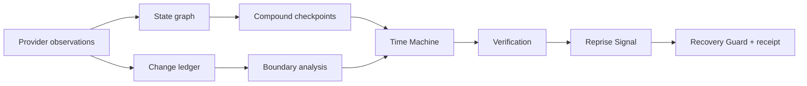

# Architecture map

The graph/ledger/checkpoint layers are provider-neutral. Provider adapters are the only place that performs platform API calls. A promotion executor is intentionally absent; the Guard returns a decision and evidence that a separately authorized executor must honor.
