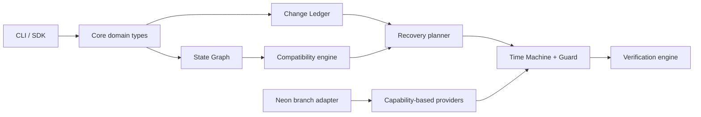

# Reprise — architecture

Reprise is a local-first recovery and compatibility control plane for changing backends. The vendor-neutral core is isolated from provider-specific actions.

## Component graph



## Invariants

- Observations in the graph and ledger are immutable evidence—not inferred marketing state.
- Providers advertise only capabilities they implement; planning refuses unsafe promotion by default.
- Recovery reconstructs compound checkpoints and verifies candidates in isolation before promotion.

## Deep dives

| Document | Contents |
| --- | --- |
| [V1_ARCHITECTURE.md](./V1_ARCHITECTURE.md) | Detailed v1 architecture and recovery reasoning |
| [../acquisition/ARCHITECTURE_MAP.md](../acquisition/ARCHITECTURE_MAP.md) | Acquisition-oriented map |
| [../acquisition/TECHNOLOGY_OVERVIEW.md](../acquisition/TECHNOLOGY_OVERVIEW.md) | Technology overview for diligence |

## Testing

```powershell
pnpm install
pnpm test
```

## Commercial

[../ACQUISITION.md](../ACQUISITION.md) · [acquisition/REPRODUCTION_COST.md](./acquisition/REPRODUCTION_COST.md)
