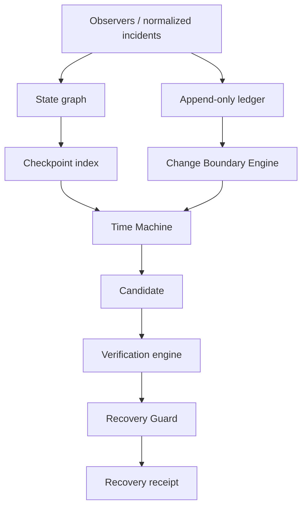

# Reprise v1 architecture

Reprise separates vendor-neutral reasoning from provider actions. The State Graph and Change Ledger retain immutable, checksummed observations. The Time Machine selects only an integrity-valid, `COMPATIBLE` checkpoint created before an incident. It never treats chronological proximity as causality.

The Change Boundary Engine ranks relevant ledger events, recording direct incident links as evidence and preserving contradictions. The Recovery Guard independently compares the candidate state revision with the live revision supplied by the executor. Any mismatch blocks promotion as stale.

The initial provider contract exposes capabilities rather than pretending every platform can restore every resource. The local acquisition fixture is provider-free. A live provider adapter must report unsupported operations explicitly.
