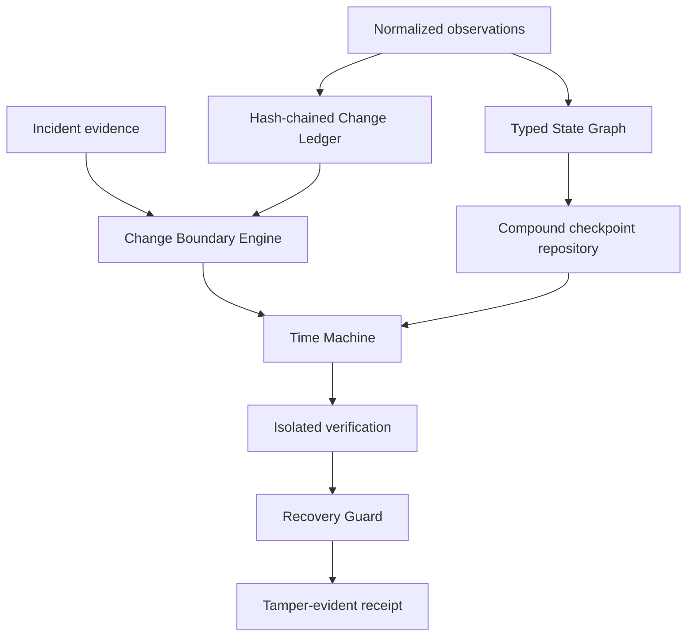
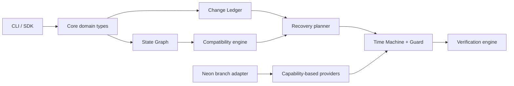

# Buyer evaluation — Reprise

## Goal

In 15–45 minutes, verify the Product builds or runs as documented and that proprietary notices are present.

## Steps

1. Confirm root `LICENSE` is proprietary and `ACQUISITION.md` exists.
2. Skim `README.md` install/run claims.
3. Execute:

```


```powershell
corepack enable
pnpm install --frozen-lockfile
pnpm build
pnpm test
node apps/cli/dist/index.js demo acquisition
```
```text
v1.7
├── schema S12
├── function F17
└── storage contract C6

v1.8
```

4. Run tests if present (`npm test`, `pytest`, `cargo test`, `go test ./...`, etc.).
5. Record README vs observed behavior gaps in workpapers.

## Pass criteria

- [ ] Clone succeeds
- [ ] Documented happy path works **or** failure is explained
- [ ] Minimal path needs no surprise secrets
- [ ] License notices intact

*Updated: 2026-09-22*
